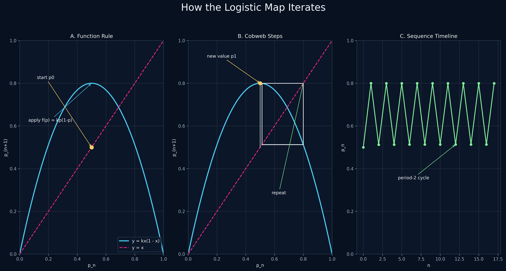
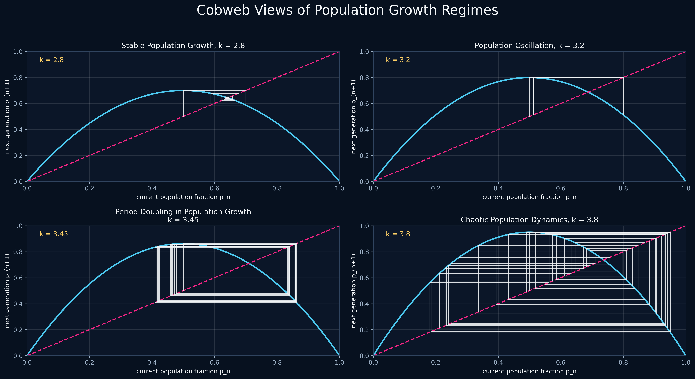
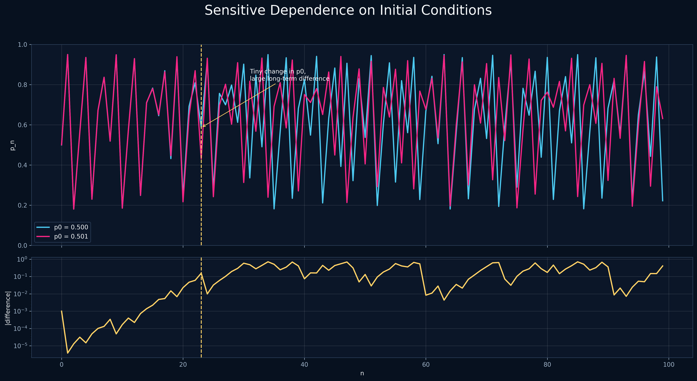

# Logistic Difference Equation Project

This project studies the logistic difference equation as a simple model of population growth:

```text
p_(n+1) = k * p_n * (1 - p_n)
```

The value `p_n` represents the population in generation `n` as a fraction of the maximum population the environment can support. The parameter `k` controls how strongly the population grows from one generation to the next. By changing `k`, the model can show stable population growth, oscillations, period doubling, and chaotic population behavior.

The program calculates population sequences for different choices of `k` and `p0`. It prints the values in the terminal and saves graphs as PNG files.

## Ecological Interpretation

- `p_n` is the population fraction in generation `n`.
- `k` controls the growth rate.
- `1 - p_n` represents resource limitation.
- The model is useful for populations that reproduce in generations, such as insects.
- For small `k`, the population stabilizes.
- For larger `k`, the population can oscillate or become chaotic.

## Visual Preview

### From Stability to Chaos


Shows how the population sequence changes as the growth parameter `k` increases: stable convergence, period doubling, and chaos.

### Iteration Process



Explains the population process visually: start from the current population `p_n`, include resource limitation `1 - p_n`, get the next generation `p_(n+1)`, and repeat.

### Cobweb Behavior



Compares stable population growth, two-generation cycles, period doubling, and chaotic population behavior using cobweb diagrams.

### Sensitivity to Initial Conditions



Shows how two very close starting populations, `p0 = 0.500` and `p0 = 0.501`, eventually separate when `k = 3.8`.

## Requirements

- Python 3
- matplotlib

Install matplotlib with:

```bash
pip install matplotlib
```

## How to Run

From this folder, run:

```bash
python main.py
```

The program will:

- create the `graphs` folder if it does not exist
- print all sequence values in the terminal
- save all PNG graphs in the `graphs` folder
- create a comparison graph for `p0 = 0.500` and `p0 = 0.501` when `k = 3.8`

## Extra Visualizations

The project also creates a bifurcation diagram and cobweb diagrams.

The bifurcation diagram shows how long-term population behavior changes when `k` changes.
The cobweb diagrams show how one generation's population produces the next generation.

## Presentation Visuals

For LaTeX or Beamer slides, run:

```bash
python presentation_visuals.py
```

New visuals are saved in `presentation_graphs/`.
PNG files are useful for quick viewing, and PDF files are better for LaTeX/Beamer.

## Presentation Files

- normal experiment graphs are in `graphs/`
- presentation-quality visuals are in `presentation_graphs/`
- PDF versions are included for LaTeX/Beamer
- `latex_figures_snippet.tex` contains ready-to-paste LaTeX figure code

## Files

- `main.py`: Python program for calculating and plotting the sequences
- `presentation_visuals.py`: creates high-quality presentation visuals
- `report.md`: short written observations for the assignment
- `latex_figures_snippet.tex`: ready-to-paste LaTeX figure code
- `graphs/`: folder containing the generated PNG graphs
- `presentation_graphs/`: folder containing PNG and PDF presentation visuals
